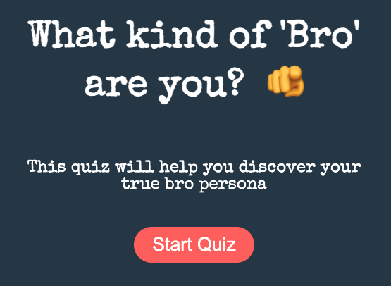

I created a quiz to share with friends. 

Live version of the <a href="https://what-bro-are-you-quiz.netlify.app/" target="_blank">Bro Quiz is here</a>

## Features 
- **Fun questions**: A series of 8 questions
- **Interactive UI**: I like to think, the quiz is visually appealing
- **Instant results**: No email, no cc required. Just complete the quiz, and get the result

## Technologies Used
- **Core Stack**: HTML, CSS & JS
- **LocalStorage**: Saving user responses for a better experience
- **Emoji's Used**: Adds a playful element to the design

## Goals
- To make my friends question their bro persona
- Bring a bit fun and joy, while providing an engaging experience

## Future Enhancements
- **Create a custom leaderboard**: A page where users can compare their persona with others

## Contributing
Contributions are welcome! If you'd like to improve, or add to it, feel free to fork the repository and submit a pull request

